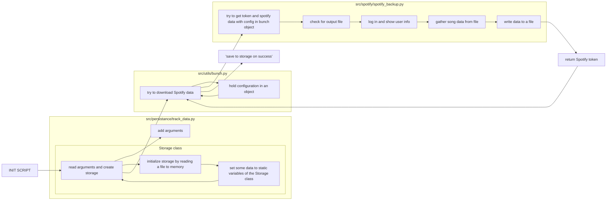

# Youtubify

Youtubify is a bundle of scripts allowing to download and organize the songs you have in your playlists on Spotify from Youtube onto your computer saving you approximately 7$ per month. Features:

- intelligent AI that verifies Youtube links before downloading
- semi-automatic visual verification of Youtube links with browser popups
- selection of playlists to be downloaded
- creation of mashup playlists of multiple spotify playlists
- automatic `idv3` tagging based on spotify metadata
- scalable design - out of 2000 songs only a hundred need manual verification

## Prerequisites

To run this bundle of scripts you need to:

1. clone this repository with `git clone git@github.com:Henri-Laiho/youtubify.git`
2. ensure you have [python3](https://www.python.org/downloads/) installed and in use (on linux debian with `sudo apt install python3`). You can verify your version with `python --version` or `python3 --version`. You can verify which executable of Python is used with `which python` / `which python3` (linux/mac) or `where.exe python` / `where.exe python3` (windows)
3. ensure you have [ffmpeg](https://ffmpeg.org/download.html) installed and in use (on linux debian with `sudo apt install ffmpeg`)
4. ensure you have installed every python package in `requirements.txt` with `pip3 install -r requirements.txt` command in the repository root directory.
5. have enough disk space for the songs to be downloaded
6. (optional) to save music in a different directory or if you have spotify local files in your playlists: copy/rename `./src/conf_private.py.example` to `./src/conf_private.py` and edit it to specify folders for music files & generated playlist files
7. (optional) to get playlist files copy/rename `conf_playlist_export.py.example` to `conf_playlist_export.py`; to get playlist files that work on another device, edit this file and specify the music file directories on the other device.

## First time usage

1. run `python spotify_import.py` and log in with your (free) spotify account
2. run `python youtubify.py list` to list your playlists
3. run `python youtubify.py activate <put playlist number here>` to select a playlist you want to download (e.g. `python youtubify.py activate 0` will select your liked songs). Run it again with a different number to add another playlist. Run `python youtubify.py list` again to see selected playlists indicated by `+`.
4. run `./fast_youtubify.ps1`, it will ask you to verify youtube links for ~5% of the songs. When it opens a youtube video with good quality, just press enter twice in the terminal, otherwise paste a better youtube (or soundcloud) link that matches the song into the terminal. You can skip this step and proceed to downloading 95% of the songs by typing `abort` in the terminal when it asks you to verify a link.
5. wait for the download to finish

## Advanced usage

You can review all steps to download music with `cat fast_youtubify.ps1`:

1. `python spotify_import.py` saves data about your playlists on your local computer
2. `python youtubify.py convert` finds Youtube links and saves them on your computer
3. `python youtubify.py review` allows you to select and correct suspicious Youtube links with a interactive CLI UI
4. `python download.py` downloads all music you selected
5. `python metadata.py` adds idv3 metadata and album art with python library `music_tag`
6. `python playlist_export.py` creates M3U8 playlist files readable by most conventional players

In all cases `python youtubify.py --help` can answer most questions. 

## Contribution

Ping @henri-laiho.

## Architecture and data flows

### spotify_import.py

This file simply takes Spotify metadata and processes it.

## Disclaimer

This is for education or personal use purposes only.

